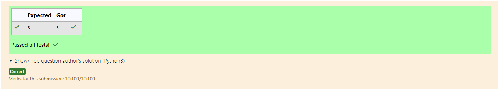

# RANK-OF-A-MATRIX
## Aim:
To write a python program to find the rank of a matrix
## Equipment’s required:
1. 	Hardware – PCs
2. 	Anaconda – Python 3.7 Installation / Moodle-Code Runner
## Algorithm:
### Step 1: 
Import the required library (numpy) in Python to perform matrix operations.
### Step 2: 
Define the matrix for which the rank is to be calculated.
### Step 3: 
Using the np.linalg.matrix_rank(), we can find the rank of the given matrix.
### Step 4: 
Display the rank of the matrix as the output.
## Program:
```
#Program to find the rank of a matrix.
#Developed by: Naveen Kumar E
#RegisterNumber:212224230181

import numpy as np
a=np.array([[5,-3,-10],[2,2,-3],[-3,-1,5]])
solution=np.linalg.matrix_rank(a)
print(solution)
```
## Output:

## Result:
Thus the rank for the given matrix is successfully solved by  using a python program.

